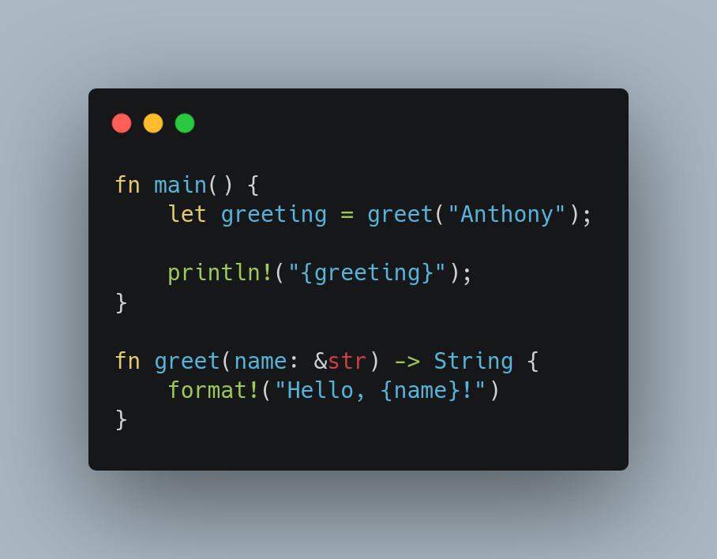

<!--
Description

Rust is one of the highest trending technologies in modern software development due to its amazing features that solves one of software's most common and old issues: memory management.. In this talk, the basics of Rust and its environment are covered, so you can start writing safe, reliable software right away!

About the speaker

Anthony Suárez is a passionate self-taught backend developer and open-source advocate. Works mainly with technologies like Python, Typescript and AWS. In his free time, he likes learning new skills like C, Rust, Haskell, and others.
-->

# Getting on the Rust train! 🦀🚂

by Anthony Suárez

 *@NeoLight1010*
 */in/neolight1010*

---

<!-- backgroundImage: url("./background-normal.jpg") -->

Rust is a systems-programming language created by Mozilla in 2010.

Having low-level capabilites, it is an alternative to languages like C and C++.

*But why should you care about Rust?*

---

# Popularity and Growth

---

Rust has remained the most loved programming language since 2016.

<!--_footer: StackOverflow Survey 2016, 2017, 2018, 2019, 2020, 2021, 2022 -->

---

Rust is associated with high paying jobs.

<!-- Rust jobs usually have high-paying salaries averaging at around $77,530 
per year, according to the 2021 StackOverflow Survey.-->

<!-- _footer: StackOverflow Surveys -->

---

Rust has the fastest growing language community! From 2020 to 2022, the
number of Rust developers has **tripled**!

<!-- Rust is mostly popular in AR/VR and IoT. Now bigger than Ruby. -->
<!-- Rust's community had nearly 2.2M developers at the time of the survey. -->

<!-- _footer: State of the Developer Nation 2022 -->

---

Rust is the #1 language for WebAssembly development. 

<!-- Most WASM developers either use Rust, or they want to use it. -->

<!--_footer: State of WASM 2021: https://blog.scottlogic.com/2021/06/21/state-of-wasm.html -->

---

Rust is a leader in the blockchain world.

Build smart contracts with frameworks like Solana.

---

Rust is the second language of the Linux kernel.

<!--
Rust interfaces and utils (replacing GNU utils) might me merged for v5.20.
Possibly 2023.
-->

<!-- _footer: https://www.phoronix.com/scan.php?page=news_item&px=Rust-For-Linux-5.20-Possible -->

---

### Companies using Rust

- : *"Rust has been a force multiplier for our team..."*
- : Rust is *"an excellent choice for security critical functions."*
- : Rust *"combines best-in-class speed with low resource usage."*
- Cloudflare, Facebook, Discord, Amazon, Microsoft, Mozilla,
  Coursera, NPM, Twitter.

<!-- 
Microsoft is a co-founder of The Rust Foundation.
-->

<!-- _footer: https://serokell.io/blog/rust-companies -->

---

## Quick introduction to Rust

What makes Rust great?

<!-- What makes Rust so attractive? -->

---

#### Goals

- Speed.
- Safety.
- Concurrency.
- Practicality.

<!--
    - Compiled language.
    - No garbage collection.

-->

<!--
     - No `null`s.
     - No dangling pointers.
     - No *unsafe*.
-->

<!--
    - No race conditions.
    - No deadlocks.
    - *Fearless concurrency*.
-->

---

### Meet the *borrow-checker*

- Each variable has an *owner*.
- You can reference another variable's value via a *reference*.
- You may either have any number of *immutable* references, or only one
  *mutable* reference at the same time.

---

### Memory safety 

Say *Goodbye!* to memory issues and other common runtime exceptions. Never more:

- Segfaults.
- `cannot access member 'x' of undefined`.
- Invalid pointers.
- Uncaught exceptions.

---

### Fearless concurrency

The borrow-checker rules make common concurrency issues *impossible*.

**Concurrency has never been easier!**

---

### Idiomatic syntax

Familiar, easy-to-understand syntax.

*Low-level power with high-level syntax.*

---

---

### Modern language features

- Pattern matching.
- Enum variants.
- Closures.
- Async/await.
- Macros!

---

### Rich type system

- Type aliases.
- Type inference.
- Structs (with methods).
- Enum variants.
- Traits (similar to Haskell *typeclasses* and OOP interfaces).
- Generics (types, traits, lifetimes).
- Helpful error messages and tips.

---

### Modern tooling

#### Cargo 

- Build tool
- Package manager.
- Test runner.
- Docs generator.

- Extensible with *plugins*.

---

#### Crates.io 

Rust's crate registry.

#### Rustfmt

Awesome formatting.

#### Rust Analyzer 

Great IDE and editor support.

#### Rustup

Get all your toolchain from a single place!

---

### Great learning material and community

- Official book: *The Rust Programming Language*
- Generated crate docs.
- Growing community of *Rusteaceans*.

---

# Enough talk!

---

# Hands on!

Let's build our first application with Rust.

---

## What we're building

A terminal hangman game.

---

## What we'll learn

- Setting up a project.
- Rust's basic syntax.
- Basic error handling.
- Enums, pattern matching, traits, closures...
- Using external *crates*.
- Rust's module system.
- Basic unit testing.

---

# Our project is finished!

Now what?

---

# Some great material

- *The Rust Programming Language* book.
- [*Let's Get Rusty*](https://www.youtube.com/c/LetsGetRusty) Youtube channel.
- [*Type-Driven API Design in Rust*](https://www.youtube.com/watch?v=bnnacleqg6k&list=PL-N92y40KxKn2wTKEB7-iJRU_IjdB7N_M&index=29&t=1964s) by Will Crichton.
- [*Whoops! I Rewrote it in Rust*](https://youtu.be/XdMgH3eV6BA) by Brian Martin.

---

# Challenges!

Some projects you can make:

- Snake game using *Piston*.
- Build a REST API using *Rocket* (web framework) and *Diesel* (ORM).
- Create a WASM web app with *Yew* (*React developers might be interested*)
- Make a cool CLI app with *tui-rs*.

The possibilites are endless!

---

# Thank you!

